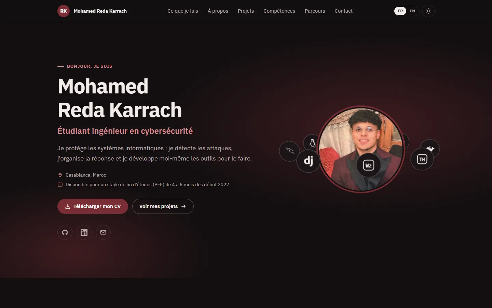

# Mohamed Reda Karrach · Portfolio

Personal portfolio of Mohamed Reda Karrach, 5th-year cybersecurity engineering student in Casablanca (SOC and Blue Team focus, pentest background, full-stack development background). Written to be readable by non-technical visitors first, with technical depth one click away.

Live site: https://redakarrach.github.io



## Sections

1. **Home.** Centred: name, role, one plain sentence, location and availability, CV download, GitHub / LinkedIn / email.
2. **What I do.** Four cards around the portrait, which sits inside a slowly rotating 3D ring of tool logos (pure CSS 3D, static under reduced motion), in plain words: monitoring and incident response, penetration testing, software development, networks and systems.
3. **About.** Three short paragraphs and four facts (location, education, languages, goal: a 4 to 6 month PFE internship from early 2027).
4. **My lab.** An interactive 3D view of both projects' real infrastructure (Canvas 2D with hand-written perspective projection, no 3D library). Drag to rotate, hover a node to read its role, click to open the project. Static under `prefers-reduced-motion`.
5. **Projects.** One card per project with a one-paragraph explanation anyone can follow, key points, technologies, the attacks it detects (MITRE ATT&CK IDs, linked), known limitations, a **View the code on GitHub** button, and a **Technical details** toggle with architecture, detection rules, playbook, validation, roadmap and screenshots (lightbox).
6. **Skills.** Grouped chips. Clicking a chip highlights the projects (and the internship) that used it. Studied subjects are labelled as such.
7. **Path.** Timeline of education, internship and projects, plus certifications and languages.
8. **Contact.** Email (with copy button), LinkedIn, GitHub, CV.

Also: FR / EN toggle (French by default), dark / light theme (follows the system on first visit, remembered in `localStorage`), print stylesheet, custom 404, Open Graph image generated at build time with the portrait.

## Architecture

```
src/
├─ app/            layout (fonts, metadata, theme boot script), page, globals.css (tokens, components, print),
│                  opengraph-image, sitemap, robots, not-found
├─ content/        ALL facts live here, typed: identity, projects, coverage (ATT&CK techniques),
│                  topology (3D scene), toolkit, path, i18n/{fr,en}, screenshots.json
├─ components/site Nav, Hero, Portrait, Services, About, Lab + LabTopology, Projects + ProjectCard + Repos,
│                  Screenshots + Lightbox, Skills, PathTimeline, Contact, Footer, Section, Icon, SkipLink
└─ lib/            providers (app state), prefs (external store for theme and language),
                   projection (3D maths), hooks, format, attack (ATT&CK links)
scripts/
├─ optimise-images.mjs   PNG screenshots → AVIF + WebP at 1600 and 640 px, writes a dimensions manifest
└─ postbuild.mjs         CSP meta tag with per-page script hashes, opengraph-image.png, .nojekyll, and the checks (no third-party resources, no inline styles, no em dashes, security.txt valid)
```

Design: deep navy background, mint accent, amber for caveats, with a light theme. All colour pairs meet WCAG 2.2 AA. IBM Plex Sans and Plex Mono are self-hosted (`src/fonts`, OFL) through `next/font/local`. Tailwind CSS 4 utilities map to CSS custom properties so one class works in both themes.

Runtime dependencies: `next`, `react`, `react-dom`. Nothing else ships to the browser.

## Run

```bash
npm install
npm run dev          # http://localhost:3000
```

```bash
npm run images       # regenerate public/screenshots from .raw-shots/*.png
npm run build        # static export to out/ plus the post-build step (CSP meta, OG image, checks)
npm run lint && npm run typecheck && npm run format:check
```

Put the CV at `public/cv/Karrach_CV.pdf` and the portrait source at `.raw-shots/profile/reda.png` (optimised copies live in `public/profile`).

## Deploy (GitHub Pages)

Every push to `main` runs `.github/workflows/pages.yml`: lint, typecheck, `npm run build` (static export plus `scripts/postbuild.mjs`), then deployment to GitHub Pages at https://redakarrach.github.io. The repository is named `RedaKarrach.github.io` so the site lives at the root of the domain. `ci.yml` runs the same checks on pull requests.

Nothing to configure after cloning. If the domain changes, update `siteUrl` in `src/content/identity.ts` and the URLs in `public/.well-known/security.txt`.

## Security

GitHub Pages cannot send custom HTTP headers, so the Content-Security-Policy is delivered as a `<meta http-equiv>` tag written into every page by `scripts/postbuild.mjs` after each build:

```
default-src none; script-src self sha256-… (one hash per inline script of that page); style-src self;
img-src self data:; font-src self; connect-src self; manifest-src self; base-uri none;
form-action none; object-src none; upgrade-insecure-requests
```

- **No `unsafe-eval`, no `unsafe-inline`.** Next.js emits a few inline bootstrap scripts and this site adds one small boot script that applies the stored theme before paint; each is hashed from the built HTML, so the policy can never be stale.
- **`style-src self` with no exception.** The exported HTML contains no `style` attribute and no `<style>` tag (checked at build time). Dynamic styles (3D view tooltip) go through the CSSOM, which CSP does not restrict.
- **What a meta policy cannot do**, stated openly: `frame-ancestors`, `Strict-Transport-Security`, `X-Content-Type-Options`, `Referrer-Policy` and `Permissions-Policy` are HTTP-header-only features and are therefore absent on GitHub Pages. HTTPS is enforced by Pages itself. The site has no forms, cookies, sessions or third-party scripts, so the practical exposure from the missing headers is limited to clickjacking of a public read-only page. A hosting platform that sets headers (Vercel, Netlify, Cloudflare Pages) would restore them without code changes.
- Every external link has `rel="noopener noreferrer"` and is announced as opening a new tab. No analytics, no trackers, no third-party scripts or fonts. A `/.well-known/security.txt` (RFC 9116) is published with the contact addresses and an expiry one year ahead.

## Measurements

| Check                               | Result                                                                          |
| ----------------------------------- | ------------------------------------------------------------------------------- |
| TypeScript / ESLint errors          | 0 / 0                                                                           |
| Lighthouse mobile (local export)    | see the table in the latest release note                                        |
| securityheaders.com                 | not applicable on GitHub Pages (no custom headers); CSP delivered as a meta tag |
| Horizontal scroll at 360 to 1600 px | none                                                                            |

## Content rules

Every fact on the site comes from the owner's own CV and project repositories: identity, education, the 2024 application security internship, the Distributed SOC Lab, ReconTool, the toolkit, certifications and languages. Nothing is invented; limitations are shown on purpose.

## Licence

Code: MIT. Content (texts, screenshots, portrait, CV) belongs to Mohamed Reda Karrach. IBM Plex is licensed under the SIL Open Font License (see `src/fonts/LICENSE-IBM-Plex.txt`).
